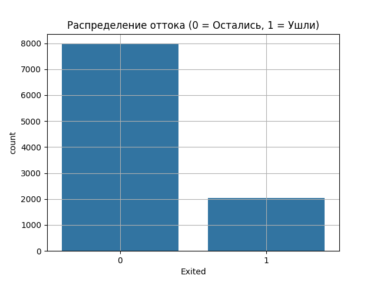
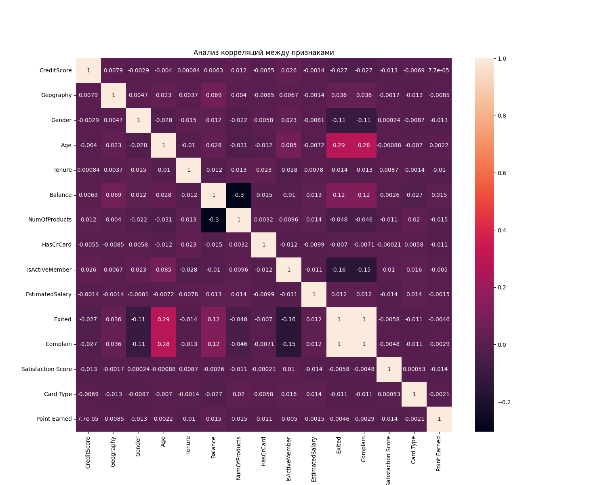

# Churn Prediction ML-Project

Система предсказания оттока клиентов с интеграцией через Web, Telegram и Desktop.

## Описание проекта
Данный проект представляет собой полноценную ML-систему для анализа и прогнозирования оттока клиентов банка. В основе лежит модель машинного обучения, которая анализирует характеристики клиентов и выдает вероятность их ухода.

##  Технологический стек
* Data Science: Python, Pandas, Scikit-learn, RandomForest
* Web: FastAPI
* Telegram Bot: Aiogram
* Desktop: PyInstaller (.exe)
* Visualization: Matplotlib, Seaborn

## Аналитика и результаты
В ходе исследования были получены следующие ключевые метрики и визуализации:

### Распределение оттока

Визуализация целевой переменной в датасете.

### Корреляция признаков

Матрица корреляции позволяет увидеть взаимосвязи между данными клиентов.

## Как запустить

### Web-интерфейс (FastAPI)
1. Перейдите в папку `WEBSITE`
2. Установите зависимости: `pip install -r requirements.txt`
3. Запустите: `uvicorn main:app --reload`

### Telegram Bot (Aiogram)
1. Перейдите в папку `TG_BOT`
2. Запустите скрипт: `python tgbot_building.py`

---
*Проект выполнен в рамках дипломной работы*. Pet-project